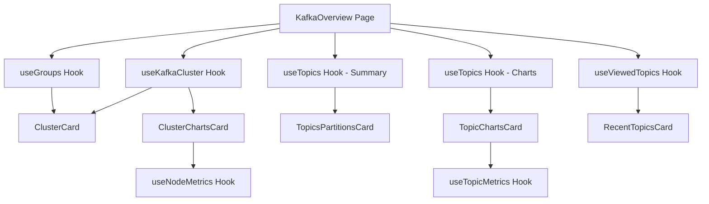

# Overview Tab Implementation Plan

## Executive Summary

This document outlines the plan to implement the Overview tab in the React application (`api/src/main/webui`) based on the deprecated Next.js UI implementation in `ui/`. The Overview tab provides a comprehensive dashboard view of a Kafka cluster with real-time metrics, status information, and quick access to key resources.

**Note**: All required API endpoints already exist. No new backend endpoints are needed.

## Current State Analysis

### Next.js Implementation (Deprecated - `ui/`)

The Next.js implementation consists of:

1. **Main Page**: [`ui/app/[locale]/(authorized)/kafka/[kafkaId]/overview/page.tsx`](ui/app/[locale]/(authorized)/kafka/[kafkaId]/overview/page.tsx:1)
   - Server-side component that fetches data
   - Orchestrates 5 main data sources:
     - Kafka cluster details with metrics
     - Topics summary (for partition counts)
     - Topics list (for charts)
     - Consumer groups
     - Recently viewed topics

2. **Layout Component**: [`ui/components/ClusterOverview/PageLayout.tsx`](ui/components/ClusterOverview/PageLayout.tsx:1)
   - 2-column grid layout (7/5 split)
   - Left column: ClusterCard, ClusterChartsCard
   - Right column: RecentTopicsCard, TopicsPartitionsCard, TopicChartsCard
   - Uses React Suspense for progressive loading

3. **Card Components**:
   - **ClusterCard** ([`ui/components/ClusterOverview/ClusterCard.tsx`](ui/components/ClusterOverview/ClusterCard.tsx:1)): Cluster status, broker count, consumer groups, Kafka version, errors/warnings
   - **ClusterChartsCard** ([`ui/components/ClusterOverview/ClusterChartsCard.tsx`](ui/components/ClusterOverview/ClusterChartsCard.tsx:1)): Disk usage, CPU usage, Memory usage charts with broker filtering
   - **TopicsPartitionsCard** ([`ui/components/ClusterOverview/TopicsPartitionsCard.tsx`](ui/components/ClusterOverview/TopicsPartitionsCard.tsx:1)): Topic counts by status (replicated, under-replicated, offline)
   - **TopicChartsCard** ([`ui/components/ClusterOverview/TopicChartsCard.tsx`](ui/components/ClusterOverview/TopicChartsCard.tsx:1)): Incoming/outgoing byte rates with topic filtering
   - **RecentTopicsCard** ([`ui/components/ClusterOverview/RecentTopicsCard.tsx`](ui/components/ClusterOverview/RecentTopicsCard.tsx:1)): Last 5 viewed topics

4. **Supporting Components**:
   - Chart components: ChartDiskUsage, ChartCpuUsage, ChartMemoryUsage, ChartIncomingOutgoing
   - Filter components: FilterByBroker, FilterByTopic, FilterByTime
   - Utility components: ErrorsAndWarnings, ChartSkeletonLoader

### React Implementation (Current - `api/src/main/webui`)

Current state:
- Basic [`KafkaOverview.tsx`](api/src/main/webui/src/pages/KafkaOverview.tsx:1) exists with minimal implementation
- Only displays cluster name and basic information
- No metrics, charts, or comprehensive dashboard features
- Uses TanStack Query hooks for data fetching

## Architecture Design

### Component Hierarchy

```
KafkaOverview (Page)
├── PageSection (Header)
│   └── Title
└── PageSection (Content)
    └── Grid (2 columns: 7/5 split)
        ├── GridItem (Left - md=7)
        │   ├── ClusterCard
        │   │   ├── Cluster status & name
        │   │   ├── Broker counts (online/total)
        │   │   ├── Consumer group count
        │   │   ├── Kafka version
        │   │   ├── Reconciliation controls (if managed)
        │   │   └── Errors/Warnings list
        │   └── ClusterChartsCard
        │       ├── Disk Usage Chart (with broker & time filters)
        │       ├── CPU Usage Chart (with broker & time filters)
        │       └── Memory Usage Chart (with broker & time filters)
        └── GridItem (Right - md=5)
            ├── RecentTopicsCard
            │   └── TopicsTable (last 5 viewed)
            ├── TopicsPartitionsCard
            │   ├── Total topics count
            │   ├── Total partitions count
            │   ├── Fully replicated count
            │   ├── Under-replicated count
            │   └── Offline count
            └── TopicChartsCard
                └── Incoming/Outgoing Bytes Chart (with topic & time filters)
```

### Data Flow



## Implementation Plan

### Phase 1: Core Infrastructure (Priority: High)

#### 1.1 Create Base Layout Structure
**File**: `api/src/main/webui/src/components/Overview/OverviewLayout.tsx`

```typescript
interface OverviewLayoutProps {
  clusterCard: ReactNode;
  clusterChartsCard: ReactNode;
  recentTopicsCard: ReactNode;
  topicsPartitionsCard: ReactNode;
  topicChartsCard: ReactNode;
}
```

**Dependencies**: PatternFly Grid, GridItem, Flex components

#### 1.2 Create Metrics Hooks
**Files**:
- `api/src/main/webui/src/api/hooks/useNodeMetrics.ts`
- `api/src/main/webui/src/api/hooks/useTopicMetrics.ts`

**API Endpoints** (already exist):
- `/api/kafkas/{kafkaId}/nodes/{nodeId}/metrics?duration[metrics]={duration}`
- `/api/kafkas/{kafkaId}/topics/{topicId}/metrics?duration[metrics]={duration}`
- `/api/kafkas/{kafkaId}?duration[metrics]={duration}` (for cluster-wide metrics)

**Features**:
- Time range filtering (5min, 15min, 1hr, 6hr, 12hr, 1d)
- Node/topic filtering
- Auto-refresh capability
- Error handling

#### 1.3 Create Viewed Topics Tracking
**File**: `api/src/main/webui/src/api/hooks/useViewedTopics.ts`

**Implementation**:
- Use localStorage to track last 5 viewed topics per cluster
- Store: `{ kafkaId, topicId, topicName, timestamp }`
- Provide hook to add/retrieve viewed topics

### Phase 2: Card Components (Priority: High)

#### 2.1 ClusterCard Component
**File**: `api/src/main/webui/src/components/Overview/ClusterCard.tsx`

**Features**:
- Cluster name and status indicator
- Broker counts (online/total) with link to nodes page
- Consumer group count with link to groups page
- Kafka version display
- Reconciliation pause/resume controls (for managed clusters)
- Errors and warnings list with expandable details
- Loading skeleton states

**Data Requirements**:
- Cluster details from `useKafkaCluster`
- Groups count from `useGroups`
- Node status from cluster relationships

**Props**:
```typescript
interface ClusterCardProps {
  cluster: KafkaCluster | undefined;
  groupsCount: number | undefined;
  brokersOnline: number;
  brokersTotal: number;
  isLoading: boolean;
}
```

#### 2.2 ClusterChartsCard Component
**File**: `api/src/main/webui/src/components/Overview/ClusterChartsCard.tsx`

**Features**:
- Three chart sections: Disk Usage, CPU Usage, Memory Usage
- Each chart has:
  - Broker filter dropdown (All Brokers, Node 0, Node 1, etc.)
  - Time range filter (5min, 15min, 1hr, 6hr, 12hr, 1d)
  - Help tooltip explaining the metric
- Handles metrics unavailable state (for virtual clusters)
- Loading skeleton states

**Chart Components to Create**:
- `ChartDiskUsage.tsx` - Stacked area chart (used/available)
- `ChartCpuUsage.tsx` - Line chart
- `ChartMemoryUsage.tsx` - Line chart

**Data Requirements**:
- Initial metrics from cluster.attributes.metrics.ranges
- Filtered metrics from `useNodeMetrics` hook

#### 2.3 TopicsPartitionsCard Component
**File**: `api/src/main/webui/src/components/Overview/TopicsPartitionsCard.tsx`

**Features**:
- Total topics count (clickable link to topics page)
- Total partitions count
- Status breakdown with icons:
  - Fully replicated (green check)
  - Under-replicated (yellow warning)
  - Offline (red error)
- Each status is a link to filtered topics page
- Help tooltips for each status
- Error state handling

**Data Requirements**:
- Topics summary from `useTopics` with `fields: "status"` and `pageSize: 1`
- Uses `meta.summary` for counts

#### 2.4 TopicChartsCard Component
**File**: `api/src/main/webui/src/components/Overview/TopicChartsCard.tsx`

**Features**:
- Incoming/Outgoing bytes chart
- Topic filter dropdown (All Topics, topic1, topic2, etc.)
- Hide internal topics toggle
- Time range filter
- Handles virtual cluster state (no metrics)
- Loading skeleton states

**Chart Component to Create**:
- `ChartIncomingOutgoing.tsx` - Dual-line chart

**Data Requirements**:
- Initial metrics from cluster.attributes.metrics.ranges
- Topic list from `useTopics` with `fields: "name,visibility"`
- Filtered metrics from `useTopicMetrics` hook

#### 2.5 RecentTopicsCard Component
**File**: `api/src/main/webui/src/components/Overview/RecentTopicsCard.tsx`

**Features**:
- Expandable card showing last 5 viewed topics
- Simple table with topic name and link
- Empty state when no topics viewed
- Link to learning resources (optional)

**Data Requirements**:
- Viewed topics from `useViewedTopics` hook

### Phase 3: Supporting Components (Priority: Medium)

#### 3.1 Chart Components
**Files**:
- `api/src/main/webui/src/components/Overview/charts/ChartDiskUsage.tsx`
- `api/src/main/webui/src/components/Overview/charts/ChartCpuUsage.tsx`
- `api/src/main/webui/src/components/Overview/charts/ChartMemoryUsage.tsx`
- `api/src/main/webui/src/components/Overview/charts/ChartIncomingOutgoing.tsx`

**Technology**: PatternFly Charts (Victory Charts)

**Common Features**:
- Responsive width using `useChartWidth` hook
- Time-based x-axis
- Formatted y-axis (bytes, percentage, etc.)
- Tooltips with formatted values
- Empty state handling
- Loading states

#### 3.2 Filter Components
**Files**:
- `api/src/main/webui/src/components/Overview/filters/FilterByBroker.tsx`
- `api/src/main/webui/src/components/Overview/filters/FilterByTopic.tsx`
- `api/src/main/webui/src/components/Overview/filters/FilterByTime.tsx`

**Features**:
- Dropdown menus with search (for topics)
- Disabled state handling
- Managed topic labels
- Clear selection option

#### 3.3 Utility Components
**Files**:
- `api/src/main/webui/src/components/Overview/ChartSkeletonLoader.tsx`
- `api/src/main/webui/src/components/Overview/ErrorsAndWarnings.tsx`
- `api/src/main/webui/src/components/Overview/useChartWidth.tsx` (hook)

### Phase 4: Integration & Polish (Priority: Medium)

#### 4.1 Update Main Overview Page
**File**: `api/src/main/webui/src/pages/KafkaOverview.tsx`

**Implementation**:
```typescript
export function KafkaOverview() {
  const { kafkaId } = useParams();
  
  // Data fetching
  const { data: cluster, isLoading: clusterLoading } = useKafkaCluster(kafkaId);
  const { data: topicsSummary } = useTopics(kafkaId, { fields: 'status', pageSize: 1 });
  const { data: topicsForCharts } = useTopics(kafkaId, { 
    fields: 'name,visibility', 
    pageSize: 100,
    includeHidden: true 
  });
  const { data: groups } = useGroups(kafkaId, { fields: 'groupId,state' });
  const viewedTopics = useViewedTopics(kafkaId);
  
  return (
    <OverviewLayout
      clusterCard={<ClusterCard ... />}
      clusterChartsCard={<ClusterChartsCard ... />}
      recentTopicsCard={<RecentTopicsCard ... />}
      topicsPartitionsCard={<TopicsPartitionsCard ... />}
      topicChartsCard={<TopicChartsCard ... />}
    />
  );
}
```

#### 4.2 Add i18n Translations
**File**: `api/src/main/webui/src/i18n/messages/en.json`

**Required Keys**:
```json
{
  "overview": {
    "title": "Overview"
  },
  "ClusterCard": {
    "Kafka_cluster_details": "Kafka cluster details",
    "online_brokers": "Online brokers",
    "consumer_groups": "Consumer groups",
    "kafka_version": "Kafka version",
    "cluster_errors_and_warnings": "Cluster errors and warnings",
    "no_messages": "No errors or warnings"
  },
  "ClusterChartsCard": {
    "cluster_metrics": "Cluster metrics",
    "used_disk_space": "Used disk space",
    "used_disk_space_tooltip": "...",
    "cpu_usage": "CPU usage",
    "cpu_usage_tooltip": "...",
    "memory_usage": "Memory usage",
    "memory_usage_tooltip": "...",
    "data_unavailable": "Metrics data unavailable",
    "virtual_cluster_metrics_unavailable": "Metrics are not available for virtual clusters"
  },
  "ClusterOverview": {
    "topic_header": "Topics",
    "total_topics": "Total topics",
    "total_partitions": "Total partitions",
    "fully_replicated_partition": "Fully replicated",
    "fully_replicated_partition_tooltip": "...",
    "under_replicated_partition": "Under-replicated",
    "under_replicated_partition_tooltip": "...",
    "unavailable_partition": "Offline",
    "unavailable_partition_tooltip": "...",
    "view_all_topics": "View all topics"
  },
  "topicMetricsCard": {
    "topic_metric": "Topic metrics",
    "topics_bytes_incoming_and_outgoing": "Topics bytes incoming and outgoing",
    "topics_bytes_incoming_and_outgoing_tooltip": "..."
  },
  "metrics": {
    "all_topics": "All topics",
    "all_brokers": "All brokers"
  }
}
```

#### 4.3 Update Routing
**File**: `api/src/main/webui/src/routes/index.tsx`

Ensure the overview route is properly configured:
```typescript
{
  path: '/kafka/:kafkaId/overview',
  element: <KafkaOverview />
}
```

### Phase 5: Testing & Documentation (Priority: Low)

#### 5.1 Component Testing
- Unit tests for each card component
- Integration tests for data fetching
- Visual regression tests (Storybook)

#### 5.2 Documentation
- Component API documentation
- Migration notes from Next.js
- Known limitations and differences

## Key Differences from Next.js Implementation

### 1. Data Fetching Strategy
- **Next.js**: Server-side data fetching with React Server Components
- **React**: Client-side with TanStack Query hooks
- **Impact**: Need to handle loading states explicitly in each component

### 2. Routing
- **Next.js**: File-based routing with parallel routes (@header, @modal)
- **React**: React Router with standard routing
- **Impact**: Simpler routing structure, no parallel routes

### 3. Internationalization
- **Next.js**: next-intl with server-side translations
- **React**: react-i18next with client-side translations
- **Impact**: Different API for accessing translations

### 4. State Management
- **Next.js**: URL-based state (searchParams) + React Context
- **React**: React state + TanStack Query cache
- **Impact**: Need to implement URL state management for filters

### 5. Viewed Topics Tracking
- **Next.js**: Server-side cookies/session
- **React**: localStorage
- **Impact**: Simpler implementation, but per-browser tracking

## Technical Considerations

### 1. Metrics Data Structure
```typescript
interface TimeSeriesMetrics {
  [timestamp: string]: number;
}

interface NodeMetrics {
  volume_stats_used_bytes: Record<string, TimeSeriesMetrics>;
  volume_stats_capacity_bytes: Record<string, TimeSeriesMetrics>;
  cpu_usage_seconds: Record<string, TimeSeriesMetrics>;
  memory_usage_bytes: Record<string, TimeSeriesMetrics>;
}

interface TopicMetrics {
  incoming_byte_rate: TimeSeriesMetrics;
  outgoing_byte_rate: TimeSeriesMetrics;
}
```

### 2. API Endpoints (All Already Exist)
- `GET /api/kafkas/{kafkaId}?fields=name,namespace,creationTimestamp,status,kafkaVersion,nodes,listeners,conditions,metrics&duration[metrics]={duration}`
- `GET /api/kafkas/{kafkaId}/topics?fields=status&page[size]=1` (for summary)
- `GET /api/kafkas/{kafkaId}/topics?fields=name,visibility&page[size]=100&sort=name&filter[visibility]=in,internal,external`
- `GET /api/kafkas/{kafkaId}/groups?fields=groupId,state`
- `GET /api/kafkas/{kafkaId}/nodes/{nodeId}/metrics?duration[metrics]={duration}` ✓ exists
- `GET /api/kafkas/{kafkaId}/topics/{topicId}/metrics?duration[metrics]={duration}` ✓ exists

**Note**: The Next.js implementation already uses these endpoints via:
- [`getKafkaCluster(kafkaId, { duration })`](ui/api/kafka/actions.ts:57) - cluster metrics with duration
- [`getNodeMetrics(kafkaId, nodeId, duration)`](ui/api/nodes/actions.ts:73) - node-specific metrics
- [`gettopicMetrics(kafkaId, topicId, duration)`](ui/api/topics/actions.ts:212) - topic-specific metrics

### 3. Performance Optimization
- Use React.memo for expensive chart components
- Debounce filter changes
- Implement virtual scrolling for large topic lists
- Cache metrics data with TanStack Query
- Progressive loading with Suspense boundaries

### 4. Accessibility
- Proper ARIA labels for charts
- Keyboard navigation for filters
- Screen reader announcements for data updates
- Color contrast compliance
- Focus management

## Existing API Endpoints

All required API endpoints already exist in the backend. The Next.js implementation uses:

1. **Cluster Metrics with Duration**:
   - Endpoint: `GET /api/kafkas/{kafkaId}?fields=...&duration[metrics]={duration}`
   - Used by: [`getKafkaCluster(kafkaId, { duration })`](ui/api/kafka/actions.ts:57)
   - Returns: Cluster-wide metrics for all nodes and topics

2. **Node-Specific Metrics**:
   - Endpoint: `GET /api/kafkas/{kafkaId}/nodes/{nodeId}/metrics?duration[metrics]={duration}`
   - Used by: [`getNodeMetrics(kafkaId, nodeId, duration)`](ui/api/nodes/actions.ts:73)
   - Returns: Metrics for a specific node (disk, CPU, memory)

3. **Topic-Specific Metrics**:
   - Endpoint: `GET /api/kafkas/{kafkaId}/topics/{topicId}/metrics?duration[metrics]={duration}`
   - Used by: [`gettopicMetrics(kafkaId, topicId, duration)`](ui/api/topics/actions.ts:212)
   - Returns: Metrics for a specific topic (incoming/outgoing bytes)

4. **Topics Summary**:
   - Endpoint: `GET /api/kafkas/{kafkaId}/topics?fields=status&page[size]=1`
   - Returns: Topic counts by status in `meta.summary`

5. **Consumer Groups**:
   - Endpoint: `GET /api/kafkas/{kafkaId}/groups?fields=groupId,state`
   - Returns: List of consumer groups with count in `meta.page.total`

**Implementation Note**: The React app will need to create TanStack Query hooks that wrap these existing API calls, similar to how the Next.js implementation uses server actions.

## Migration Strategy

### Phase 1: Parallel Development
1. Keep Next.js implementation running
2. Build React components in isolation
3. Test with Storybook
4. Compare visual output

### Phase 2: Integration
1. Wire up data fetching
2. Test with real API
3. Performance testing
4. Accessibility audit

### Phase 3: Cutover
1. Feature flag to switch between implementations
2. Monitor for issues
3. Gather user feedback
4. Remove Next.js code

## Success Criteria

1. **Functional Parity**: All features from Next.js implementation work in React
2. **Performance**: Page load < 2s, chart rendering < 500ms
3. **Accessibility**: WCAG 2.1 AA compliance
4. **Test Coverage**: > 80% unit test coverage
5. **User Experience**: No regressions in usability

## Timeline Estimate

- **Phase 1** (Core Infrastructure): 3-4 days
- **Phase 2** (Card Components): 5-7 days
- **Phase 3** (Supporting Components): 3-4 days
- **Phase 4** (Integration & Polish): 2-3 days
- **Phase 5** (Testing & Documentation): 2-3 days

**Total**: 15-21 days (3-4 weeks)

## Risks & Mitigations

### Risk 1: Metrics API Not Available
**Mitigation**: Implement mock data layer, graceful degradation

### Risk 2: Performance Issues with Large Datasets
**Mitigation**: Implement pagination, data sampling, virtualization

### Risk 3: Chart Library Compatibility
**Mitigation**: Evaluate Victory Charts early, have backup plan (Recharts)

### Risk 4: State Management Complexity
**Mitigation**: Use TanStack Query for server state, minimize local state

## Open Questions

1. Should we implement the reconciliation pause/resume feature in Phase 1?
2. Do we need to support the same level of error handling as Next.js?
3. Should viewed topics be synced across devices (requires backend)?
4. What's the priority for mobile responsiveness?
5. Should we implement real-time updates (WebSocket) or stick with polling?

## References

- Next.js Overview Implementation: `ui/app/[locale]/(authorized)/kafka/[kafkaId]/overview/`
- Next.js Components: `ui/components/ClusterOverview/`
- React Hooks: `api/src/main/webui/src/api/hooks/`
- PatternFly React: https://www.patternfly.org/components/charts
- TanStack Query: https://tanstack.com/query/latest